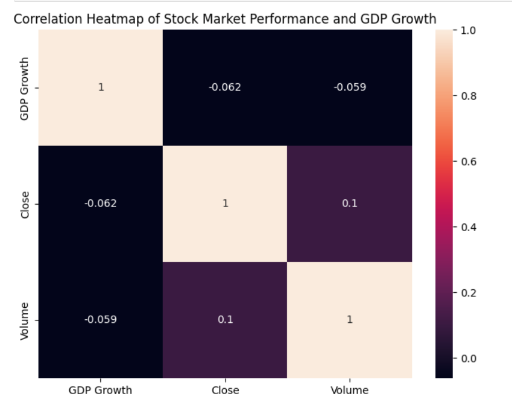
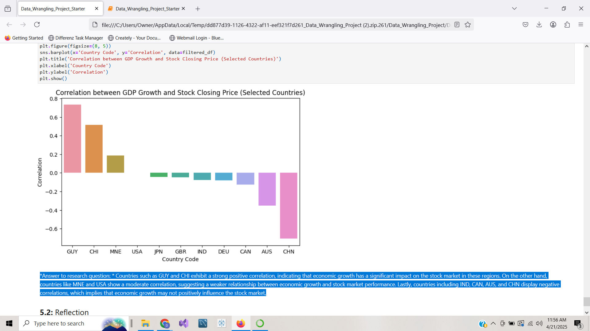

# 🚀 Real‑World Data Wrangling Project

An end‑to‑end wrangling and exploratory analysis of two datasets—daily stock‑market indices and macroeconomic indicators—to uncover how GDP growth drives market volatility.

---

## 📋 1. Problem Statement

We investigate how macroeconomic factors influence S&P 500 (SPY) performance:

- **Q1:** How do SPY closing prices and trading volumes correlate with GDP growth?  
- **Q2:** Does GDP growth in different countries explain variations in SPY performance?

---

##  🔍 2. Datasets

- Google Dataset Search https://datasetsearch.research.google.com/
- The U.S. Government’s open data https://data.gov/
- UCI Machine Learning Repository https://archive.ics.uci.edu/ml/index.php

### 2.1 Macroeconomic Indicators  
- **Type:** CSV (manual download from World Bank)  
- **Method:** downloaded “GDP growth” series as CSV  

### 2.2 Stock Market Data (SPY)  
- **Type:** API (Yahoo Finance)  
- **Method:** fetched via `yfinance` (API)  
- **Date range:** 1994‑01‑01 → 2024‑01‑01
   
---

##  🧹 3. Data Cleaning & Wrangling 
   - Standardized dates, dropped duplicates/unused columns  
   - Reshaped stock data, removed GDP metadata, merged on year
     
---

## 🗄️ 4. Data Storage   
   - Saved raw vs. cleaned CSVs under `data/raw/` & `data/clean/`
     
---

## 📊 4. Analysis & Visualization
   - Correlation heatmap of SPY vs. GDP growth
       

   - Country‑level correlations (e.g. GUY, CHI positive; IND, CAN negative)
        

